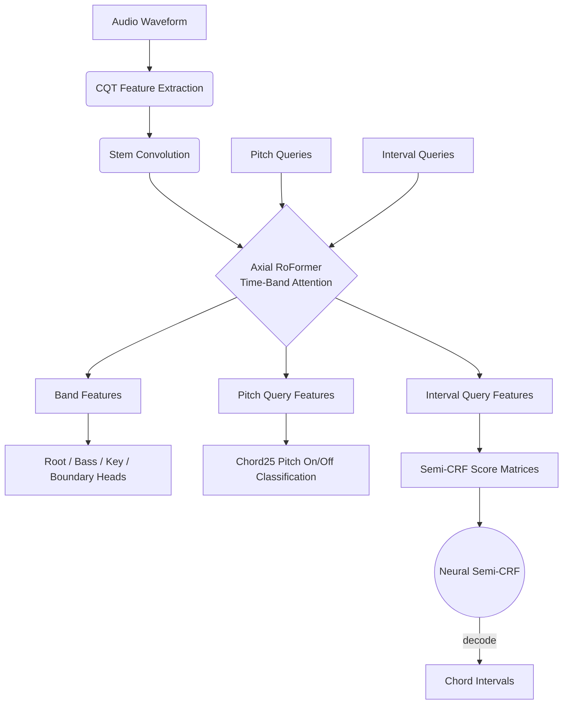

# Chord-Transcription
[English](README.md) | **日本語**

[](https://colab.research.google.com/github/anime-song/Chord-Transcription/blob/main/Chord_Transcription.ipynb)

コード採譜モデルを学習するリポジトリです。
**CQT**、**Axial RoFormer** アーキテクチャ、および **Neural Semi-CRF** を活用して、正確なコード区間と文脈解釈による高精度な推論を実現しています。

## アーキテクチャ



本モデルは特徴抽出と予測を専門的に分離しています：
1. **Backbone**: CQT 特徴量を Time-Band Axial RoFormer ブロックを使用して処理します。
2. **Queries**: ピッチ予測（25種）およびコード区間スコアのための専用トークンが結合され、Transformer レイヤーを通過します。
3. **Semi-CRF**: フレーム単位の独立した分類ではなく、Neural Semi-CRF を用いてコード区間の最適なシーケンスを予測・最適化します。

# データセット作成パイプライン

このドキュメントは、モデルの学習に使用するデータセットを準備するための一連の前処理パイプラインを説明します。各ステップを順番に実行してください。

-----

### Step 1. ステム分離とリサンプリング

楽曲の音声ファイルから各楽器のステム（ボーカル、ドラム、ベース、その他）を分離し、指定されたサンプリングレートに変換します。

```bash
uv run python -m src.preprocess.separate_and_resample --input <input_dir> --out-dir <output_dir>
```

  * `--input_dir`: 処理対象の音声ファイルが格納されているディレクトリ。
      * **Default**: `./dataset/songs`
  * `--out-dir`: ステム分離後の音声ファイルの保存先。
      * **Default**: `./dataset/songs_separated`

-----

### Step 2. ピッチシフトによるデータ拡張

ステム分離後の音声に対し、ピッチシフトを適用して学習データを水増しします（データ拡張）。

```bash
uv run python -m src.preprocess.pitch_shift_augment --target_dir <target_dir>
```

  * `--target_dir`: ピッチシフトを適用する音声ファイルが格納されているディレクトリ。
      * **Default**: `./dataset/songs_separated`

-----

### Step 3. コードデータの正規化

元のコード表記（例: `CM7`, `Gm`, etc.）を、モデルが学習しやすい統一された形式に正規化します。

```bash
uv run python -m src.preprocess.normalize_chords --input_dir <input_dir> --output_dir <output_dir>
```

  * `--input_dir`: 正規化前のコードデータが保存されているディレクトリ。
      * **Default**: `./dataset/chords`
  * `--output_dir`: 正規化後のコードデータの保存先。
      * **Default**: `./dataset/chords_normalize`

-----

### Step 4. 学習用ペアの作成

処理済みの音声ファイルと、対応するコード・キーの各ラベル情報を紐付けたCSVファイル（学習用・検証用ペアリスト）を作成します。

```bash
uv run python -m src.preprocess.make_pairs_csv --chords_dir <chords_dir> --keys_dir <keys_dir> --songs_separated_dir <songs_separated_dir> --validation_ratio <validation_ratio>
```

  * `--chords_dir`: 正規化後のコードが保存されているディレクトリ。
  * `--keys_dir`: キー情報が保存されているディレクトリ。
  * `--songs_separated_dir`: ステム分離後の音声が保存されているディレクトリ。
  * `--validation_ratio`: 全データのうち、検証用データとして分割する割合。

-----

### Step 5. コードクオリティの出現頻度計算

学習時の損失関数で使用するために、データセット全体における各コードクオリティ（`Major`, `minor`など）の出現頻度を計算します。

```bash
uv run python -m src.preprocess.count_quality_freq --data_folder <data_folder> --quality_definition <quality_definition> --output <output>
```

  * `--data_folder`: 正規化されたコードが保存されているディレクトリ。
      * **Default**: `./dataset/chords_normalize`
  * `--quality_definition`: コードクオリティの定義ファイル。
      * **Default**: `./data/quality.json`
  * `--output`: 計算結果の出力先ファイルパス。
      * **Default**: `./data/quality_freq_count.json`

-----


# 学習
### Step 1. Base モデルの学習

```bash
uv run python -m src.train_transcription --config ./configs/train_large.yaml
```

### Step 2. CRF モデルの学習

checkpointにはBaseモデルの重みを指定します。

```bash
uv run python -m src.train_crf --config ./configs/train_large.yaml --checkpoint <base_transcription.pt> --training_backbone
```

# 推論

### Base モデルで推論する場合

```bash
uv run python -m src.chord_transcription.inference --checkpoint <base_transcription.pt> --audio <audio_path> --decode crf_pool
```
*Note: Base モデルでは `argmax`, `hmm`, `crf_pool` のデコードモードが選択可能です。*

### CRF モデルで推論する場合

```bash
uv run python -m src.chord_transcription.inference --checkpoint <crf_model.pt> --audio <audio_path> --decode auto
```

Python ライブラリとして使う場合の import は `chord_transcription` に寄せています。
例: `from chord_transcription import TranscriptionPredictor`

例:

```python
from chord_transcription import TranscriptionPredictor

predictor = TranscriptionPredictor.from_pretrained(
    "anime-song/Chord-Transcription",
    filename="model_epoch_150_public.pt",  # 複数 checkpoint を置く場合は明示
)
```

### 学習済み Backbone のファインチューニング

同じアーキテクチャのまま学習を継続するなら `build_model_from_pretrained()` を使います。
独自の task head を付けたい場合は、モデルを自前で組み立てて `load_pretrained_backbone()` で `backbone.*` だけ読み込みます。

```python
import torch
from chord_transcription import build_model_from_pretrained

device = "cuda" if torch.cuda.is_available() else "cpu"

model = build_model_from_pretrained(
    "anime-song/Chord-Transcription",
    filename="model_epoch_150_public.pt",
    device=device,
)
model.train()  # pretrained helper は eval mode で返す

# root_chord / bass head は標準では backbone へ勾配を流しません。
# それらの loss でも backbone を更新したい場合は False にします。
model.set_label_head_detach(False)

optimizer = torch.optim.AdamW(model.parameters(), lr=1e-5, weight_decay=1e-2)

outputs = model(waveform)
loss = your_loss_fn(outputs, batch)
loss.backward()
optimizer.step()
optimizer.zero_grad(set_to_none=True)
```

backbone だけ初期化して新しい head を付けたい場合:

```python
from chord_transcription import build_model_from_config, load_pretrained_backbone

model = build_model_from_config(cfg).to(device)
load_pretrained_backbone(
    model.backbone,
    "anime-song/Chord-Transcription",
    filename="model_epoch_150_public.pt",
)
model.train()
```

### Frozen Backbone に対する Linear Probe

backbone を凍結し、抽出したフレーム特徴の上に線形 head だけを学習します。

```python
import torch
import torch.nn as nn
from chord_transcription import build_backbone_from_pretrained

device = "cuda" if torch.cuda.is_available() else "cpu"

backbone = build_backbone_from_pretrained(
    "anime-song/Chord-Transcription",
    filename="model_epoch_150_public.pt",
    device=device,
)
for param in backbone.parameters():
    param.requires_grad = False
backbone.eval()

probe = nn.Linear(backbone.output_dim, num_labels).to(device)
optimizer = torch.optim.AdamW(probe.parameters(), lr=1e-3)

with torch.no_grad():
    backbone_out = backbone(waveform)

# 例: frame-wise labeling に band features を使う
logits = probe(backbone_out.band_features)
loss = criterion(logits.transpose(1, 2), target)
loss.backward()
optimizer.step()
optimizer.zero_grad(set_to_none=True)
```

`Backbone.forward()` は各クエリごとに対応した `band_features`, `pitch_query_features`, `interval_query_features` を格納した `BackboneOutput` オブジェクトを返します。

# 学習済みモデル

[ここ](https://huggingface.co/anime-song/Chord-Transcription/tree/main)からダウンロードできます。
